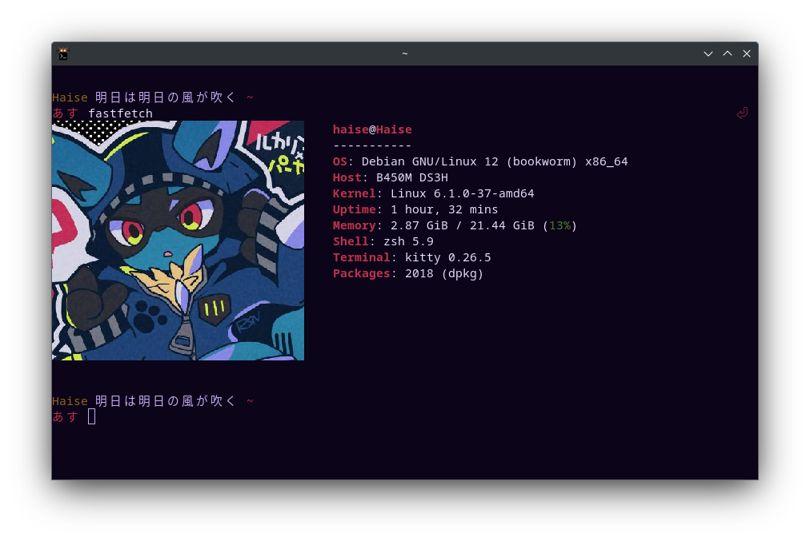

# Config files that I use 

- kitty
- nvim
- .tmux.conf
- ArrowKeyRemap.ahk : requires AHK software
- utilidades : fzf


## compilar nvim desde código:

Asegúrate de haber instalado todo:

```bash
sudo apt install ninja-build gettext cmake unzip curl build-essential libtool libtool-bin autoconf automake pkg-config libuv1-dev libmsgpack-dev libunibilium-dev
```

Y luego compilar correctamente:

```bash
git clone https://github.com/neovim/neovim.git
cd neovim
git checkout stable
make CMAKE_BUILD_TYPE=Release
sudo make install
```

---


## SETUP FZF 

```bash
sudo apt install fzf -y
```

fix ctrl-r binding
- Bash

Append this line to ~/.bashrc to enable fzf keybindings for Bash:

   source /usr/share/doc/fzf/examples/key-bindings.bash

Append this line to ~/.bashrc to enable fuzzy auto-completion for Bash:

   source /usr/share/doc/fzf/examples/completion.bash

- Zsh

Append this line to ~/.zshrc to enable fzf keybindings for Zsh:

   source /usr/share/doc/fzf/examples/key-bindings.zsh

Append this line to ~/.zshrc to enable fuzzy auto-completion for Zsh:

   source /usr/share/doc/fzf/examples/completion.zsh


# KITTY config


```bash
cd dot-files
cp kitty/kitty.conf ~/.config/kitty/kitty.conf #tema para kitty
```

## zshell + ohmyzsh

### instalar zshell

```bash
sudo apt install zsh
chsh -s $(which zsh)
```

### instalar ohmyzsh

```bash
sh -c "$(curl -fsSL https://raw.githubusercontent.com/ohmyzsh/ohmyzsh/master/tools/install.sh)"
```

### Instalar tema personalizado para zsh

original: https://github.com/Daivasmara/daivasmara.zsh-theme/tree/master

```bash
cp kitty/daivasmara.zsh-theme ~/.oh-my-zsh/themes # tema para zsh
```

luego actualizar la variable

```bash
ZSH_THEME="daivasmara"
```

### instalar zsh-autosuggestions

```bash
git clone https://github.com/zsh-users/zsh-autosuggestions ${ZSH_CUSTOM:-~/.oh-my-zsh/custom}/plugins/zsh-autosuggestions
```

Actualizar variable plugins en ~/.zshrc

```bash
plugins=(git zsh-autosuggestions)
```

# FastFetch

Compilarlo:

```bash
sudo apt install git cmake build-essential libwayland-client0 libx11-dev libxft-dev libxcb1-dev

git clone https://github.com/fastfetch-cli/fastfetch.git
cd fastfetch
mkdir build && cd build
cmake ..
make -j$(nproc)
sudo make install
```

Imagenes para fastfetch

```bash
cd dot-files
cp -r fastfetch-images ~/Pictures
```

Agregar alias con imagen customizada al .zshrc

```bash
alias fastfetch="fastfetch --kitty-direct ~/Downloads/0xinterrupthandler.png
--logo-width 35  --logo-height 15"
```


# Result




